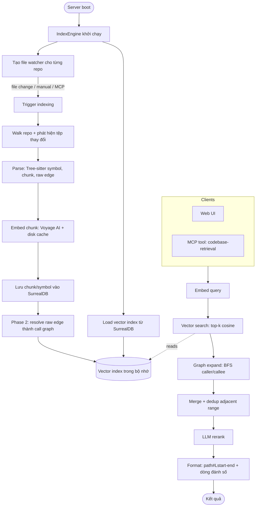

# context-engine

[English](README.md) · **Tiếng Việt** · [中文](README-zh.md)


## Cài đặt & Chạy

Chạy bản phát hành mới nhất trực tiếp bằng npx — không cần tải thủ công, npx
sẽ tự động lấy đúng bản binary đã biên dịch sẵn cho nền tảng của bạn. Thẻ
`@latest` buộc npx lấy phiên bản mới nhất đã phát hành thay vì dùng lại bản
cache cũ:

```bash
npx context-engine@latest
```

Lệnh này khởi động HTTP server ở cổng 6699 (Web UI tại
http://127.0.0.1:6699, MCP endpoint tại `/mcp`). Mọi cờ CLI đều được chuyển
tiếp tới binary:

```bash
npx context-engine@latest --port 8080 --bind 0.0.0.0
```

Hoặc cài đặt toàn cục để có lệnh `context-engine` cố định:

```bash
npm install -g context-engine@latest
context-engine --port 6699
```

Nền tảng được hỗ trợ: Linux x64/arm64, macOS arm64, Windows x64.

## Tính năng

| Tính năng | Mô tả |
|-----------|-------|
| Semantic code search | Tìm mã theo ý nghĩa thông qua embedding, không khớp văn bản thuần |
| Multi-language parsing | Extract symbol bằng Tree-sitter cho 23 ngôn ngữ (xem bảng bên dưới) |
| Call-graph expansion | Resolve caller/callee edge và BFS expand các symbol khớp khi query |
| Import-path resolution | Trace import tới file thật cho TS/JS, Python, Go, Rust — resolve cross-module call mà name matching bỏ lỡ |
| Framework-aware resolution | Phát hiện React, Express, Django, Spring, Go Gin và tạo routing/DI/rendering edge tự động |
| Generated-file detection | Downrank protobuf stub, gRPC scaffolding, mock, codegen output — hand-written code hiển thị trước |
| Field-qualified search | Filter kết quả bằng prefix `kind:function`, `lang:rust`, `path:src/api`, `name:Handler` trong query |
| Enriched caller/callee output | Kết quả MCP hiển thị tên symbol `[callers: fn_a, fn_b +N more]` thay vì chỉ số đếm |
| Incremental indexing | Chỉ re-index các tệp đã thay đổi (mtime + watcher), crash-safe nhờ commit marker theo từng tệp |
| Real-time file watching | `notify` (debounce) tự động trigger re-index khi tệp thay đổi |
| Voyage AI embedding | HTTP embedding client có disk cache để tránh gọi API thừa |
| LLM rerank | Sắp xếp lại các candidate chunk bằng LLM (OpenAI / Google); tùy chọn, có thể tắt |
| Embedded SurrealDB | Lưu chunk, symbol và edge; một datastore cho mỗi repo |
| HTTP API + Web UI | Quản lý cấu hình, index explorer và bảng điều khiển thử query |
| MCP server | `codebase-retrieval`, `file-retrieval` (opt-in), các graph tool chỉ đọc `trace-path` / `symbol-context` / `impact` / `changes-impact`, prompt hướng dẫn, và tool khám phá `list_repos` luôn khả dụng |
| Secret redaction | API key và thông tin xác thực được che khỏi nội dung chunk trước khi tới rerank LLM hoặc bất kỳ output nào |
| Truy vấn lai | Fallback lexical hợp nhất với tìm kiếm vector qua RRF có trọng số (bật theo mặc định; `CONTEXT_ENGINE_LEXICAL=0` để tắt) |
| Portable graph export | `export-graph` ghi nodes, edges và confidence từng edge ra artifact JSON có phiên bản (hoặc sơ đồ Mermaid qua `--format mermaid`) |
| Graph view | Trang `/graph.html` tự chứa vẽ graph lạnh có giới hạn thành SVG tương tác — không phụ thuộc JS ngoài |
| Area guidance | `export-areas` suy ra các area chức năng từ call graph (thành phần liên thông, không LLM) và ghi file hướng dẫn agent theo từng area |
| SSE progress stream | Truyền sự kiện indexing progress trực tiếp tới UI |
| Large-repo scaling | Bounded memory và không có đường O(n²) — xây dựng cho codebase quy mô Linux/Chromium |

## Công cụ MCP

Cả hai MCP endpoint — `/mcp` toàn cục (truyền đường dẫn tuyệt đối
`workspace_full_path` ở mỗi lần gọi) và từng `/mcp-repo/<name>` theo repo
(workspace được gắn sẵn) — expose cùng một bộ tool. Cấu hình mới bật sẵn
`codebase-retrieval` và các graph tool chỉ đọc (`trace-path`, `symbol-context`,
`impact`, `changes-impact`); riêng `file-retrieval` vẫn là opt-in qua
`enabled_mcp_tools` trong settings (hoặc Web UI). `list_repos` luôn được
expose, vì việc khám phá không được phụ thuộc vào opt-in. Cả hai endpoint cũng
cung cấp hai MCP prompt (`detect-impact`, `generate-map`) và resource chỉ đọc
`ce://repos` (chính là nội dung `list_repos` in ra — việc đọc không bao giờ
spawn worker). Trên endpoint toàn cục, các tool gắn với repo được chuyển tiếp
tới worker của repo đó, nên output giống hệt per-repo endpoint:

| Tool | Tham số chính | Mục đích |
|------|---------------|---------|
| `codebase-retrieval` | `workspace_full_path`, `information_request`, tùy chọn `max_tokens` | Tìm kiếm ngữ nghĩa với call-graph expansion và LLM rerank |
| `file-retrieval` | `workspace_full_path`, `file_path`, `information_request`, tùy chọn `top_k`, `max_tokens` | Truy hồi giới hạn trong một file |
| `list_repos` | — | Khám phá chỉ đọc: các repo đã cấu hình, tên per-repo endpoint và trạng thái index |
| `trace-path` | `workspace_full_path`, `from_symbol`, `to_symbol`, tùy chọn `direction` (`callees`/`callers`), `max_depth` (mặc định 5, giới hạn 10) | Đường gọi giữa hai symbol; edge extracted được ưu tiên hơn edge inferred |
| `symbol-context` | `workspace_full_path`, `symbol` | Nguồn định nghĩa đánh số dòng cùng tóm tắt caller/callee của một symbol |
| `impact` | `workspace_full_path`, `symbol`, tùy chọn `max_depth` (mặc định 3, giới hạn 8) | Duyệt call-graph ngược theo tầng caller, kèm tóm tắt các file bị ảnh hưởng nhiều nhất |
| `changes-impact` | `workspace_full_path`, tùy chọn `git_diff`, tùy chọn `max_depth` (mặc định 2, giới hạn 5) | Map các dòng ADDED của một unified diff lên symbol đã index và liệt kê caller bị ảnh hưởng; bỏ qua `git_diff` thì engine tự chạy `git diff HEAD` trong repo |

Symbol chấp nhận FQN đầy đủ (`/abs/file.rs::mod::name`), `file.rs::name`,
`::name`, hoặc tên trần; tham chiếu mơ hồ sẽ trả về danh sách candidate thay vì
đoán. Việc cắt bớt do chạm giới hạn depth hay budget luôn được nói rõ, không
bao giờ im lặng. Các graph tool chỉ đọc call graph của repo đó — caller
cross-repo không được đi tiếp (theo [decision
0002](docs/decisions/0002-multi-repo-namespace.md)).

### Truy vấn lai (vector + hợp nhất lexical)

`codebase-retrieval` và `file-retrieval` hợp nhất một quét lexical có giới hạn
trên các chunk đã index với tìm kiếm vector trước khi mở rộng call graph. Quét
chạy các pool CONTAINS theo từng term (không thêm index, không di chuyển
schema), chấm điểm bằng độ phủ term có trọng số IDF, và nhận diện khi một row
**chính là** identifier được truy vấn (khớp nguyên token, hiểu snake/camel):
row witness có thể lên tới 0.8 còn row chỉ nhắc tới chạm trần 0.55 — dưới dải
cosine của vector — nên fallback không bao giờ lấn át các định nghĩa đầu bảng
của vector. Reciprocal Rank Fusion (k=60, trọng số hạng lexical 0.7) chỉ quyết
định thứ tự; điểm trả về giữ nguyên ý nghĩa nguồn. Hợp nhất **bật theo mặc
định**; đặt `CONTEXT_ENGINE_LEXICAL=0` (`false`/`off`/`no`/`disabled`) để tắt
trên các host nhạy cảm độ trễ. Trên bài test A/B 40 cặp truy hồi, nó trung
tính về recall so với baseline chỉ-vector (r@1/r@5/r@10/IoU giống hệt); lợi
ích đảm bảo là fallback khi vector bỏ lỡ (tên symbol chính xác, term hiếm —
tức là khi truy vấn theo đúng tên identifier).

### Secret redaction

Nội dung chunk được che mũ trước khi tới rerank LLM hoặc bất kỳ output nào.
Token có dạng vendor (Anthropic/OpenAI/GitHub, Google, Slack, npm, Stripe, AWS,
JWT, PEM private key) trở thành `[REDACTED:<kind>]`; header `Authorization:
Bearer/Basic/Token` và URL DSN có userinfo giữ phần prefix đáng tin và bỏ phần
credential; phép gán trông như secret giữ lại định danh và che giá trị. Code
thường (`password: String`, `process.env.API_KEY`) đi qua nguyên vẹn, và việc
redaction có tính idempotent.

### Lệnh CLI one-shot

```bash
# Ghi MCP client config + file hướng dẫn agent cho repo đã được cấu hình
# trong engine (bản CLI twin của nút "Auto Setup" trên Web UI; không bao giờ
# khởi động engine)
context-engine setup --repo /duong/dan/toi/repo [--tool claude,codex,opencode|all] [--port 6699] [--bind 127.0.0.1] [--url https://proxy]

# Xuất call graph ra artifact JSON di động (context-engine-graph/v1)
context-engine export-graph --repo /duong/dan/toi/repo [--format json|mermaid] [--out graph.json] [--max-nodes N] [--max-edges N]

# Ghi các file hướng dẫn theo area từ call graph (thành phần liên thông —
# tất định, không LLM, không clustering)
context-engine export-areas --repo /duong/dan/toi/repo [--out-dir areas] [--max-area-size N]
```

### Nhà cung cấp embedding

Voyage là mặc định. Ollama dùng endpoint HTTP native và không bắt buộc API key:

```json
{"embedding":{"provider":"ollama","model":"nomic-embed-text","api_keys":[],"ollama_base_url":"http://127.0.0.1:11434/api/embed"}}
```

ONNX chạy local với model và tokenizer do người dùng cung cấp ngoài repository:

```json
{"embedding":{"provider":"onnx","model":"local-sentence-transformer","api_keys":[],"onnx_model_path":"/models/model.onnx","onnx_tokenizer_path":"/models/tokenizer.json"}}
```

ONNX yêu cầu input có tên `input_ids`, `attention_mask` và tùy chọn
`token_type_ids`, sau đó mean pooling theo attention mask và L2 normalization.
Một fixture chỉ dùng trong test đã xác minh input đảo thứ tự, `token_type_ids`
tuỳ chọn, pooling, normalization và đường operator `Cast`/`Add`/`Unsqueeze`/`Concat`.
Fixture không đảm bảo tương thích với mọi ONNX model.

## Ngôn ngữ được hỗ trợ

Việc extract symbol bằng Tree-sitter (hàm, lớp, phương thức và call edge)
được hiện thực riêng cho từng ngôn ngữ. Phần mở rộng tệp được ánh xạ trong
`detect_language` (`src/parsing/mod.rs`).

| Ngôn ngữ | Phần mở rộng | Grammar |
|----------|--------------|---------|
| Python | `.py` | `tree-sitter-python` |
| JavaScript | `.js`, `.jsx`, `.mjs`, `.cjs` | `tree-sitter-javascript` |
| TypeScript | `.ts` | `tree-sitter-typescript` |
| TSX | `.tsx` | `tree-sitter-javascript` |
| Rust | `.rs` | `tree-sitter-rust` |
| Go | `.go` | `tree-sitter-go` |
| Java | `.java` | `tree-sitter-java` |
| C | `.c` | `tree-sitter-c` |
| C++ | `.cpp`, `.cc`, `.cxx`, `.h`, `.hpp`, `.hxx`, `.hh` | `tree-sitter-cpp` |
| C# | `.cs` | `tree-sitter-c-sharp` |
| PHP | `.php` | `tree-sitter-php` |
| Ruby | `.rb` | `tree-sitter-ruby` |
| Objective-C | `.m`, `.mm` | `tree-sitter-objc` |
| Swift | `.swift` | `tree-sitter-swift` |
| Kotlin | `.kt`, `.kts` | `tree-sitter-kotlin` |
| Dart | `.dart` | `tree-sitter-dart` |
| Lua | `.lua` | `tree-sitter-lua` |
| Luau | `.luau` | `tree-sitter-luau` |
| Svelte | `.svelte` | `tree-sitter-javascript` (script block) |
| Vue | `.vue` | `tree-sitter-javascript` / `tree-sitter-typescript` (script block) |
| Protocol Buffers | `.proto` | `tree-sitter-protobuf` (vendored) |
| Pascal | `.pas`, `.pp`, `.dpr`, `.lpr`, `.dpk` | `tree-sitter-pascal` |
| Liquid | `.liquid` | `tree-sitter-liquid` |

Tệp có phần mở rộng khác vẫn được chia chunk và embedding để tìm kiếm ngữ nghĩa,
nhưng không extract symbol hay call edge từ chúng.

## Cách hoạt động



## Đóng góp

Chúng tôi hoan nghênh các **feature request được mô tả bằng văn bản** — hãy mở
một issue mô tả hành vi bạn mong muốn, và chúng tôi sẽ cân nhắc đưa vào roadmap.

Hiện tại chúng tôi **chưa nhận các pull request có chứa code**, **ngoại trừ duy
nhất bug fix**. Nếu bạn muốn đề xuất một tính năng mới, vui lòng tạo một
feature-request issue thay vì gửi PR code. Các PR bug fix (kèm mô tả rõ ràng về
bug và cách sửa) thì luôn được hoan nghênh.
