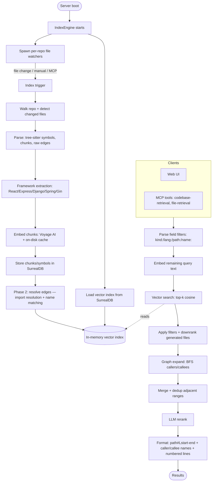

# context-engine

**English** · [Tiếng Việt](README-vi.md) · [中文](README-zh.md)


## Install & Run

Run the latest release directly with npx — no manual download, the correct
prebuilt binary for your platform is fetched automatically. The `@latest`
tag forces npx to fetch the newest published version instead of reusing a
stale cached one:

```bash
npx context-engine@latest
```

This boots the HTTP server on port 6699 (web UI at http://127.0.0.1:6699,
MCP endpoint at `/mcp`). Any CLI flags are forwarded to the binary:

```bash
npx context-engine@latest --port 8080 --bind 0.0.0.0
```

Or install it globally to get a persistent `context-engine` command:

```bash
npm install -g context-engine@latest
context-engine --port 6699
```

### Runtime model and data paths

The default router listens on `127.0.0.1:6699`. A worker-free smoke check is:

```bash
curl http://127.0.0.1:6699/api/config
```

Action requests (such as indexing, queries, and MCP tool calls) select a
repository and spawn an on-demand worker for it. Read-only detail routes such
as index stats, graph, files, and status use sidecars or cold state and do not
spawn a worker. The global `/mcp` endpoint exposes both MCP tools; each call
selects its repository with the absolute `workspace_full_path` argument.

Fresh settings enable only `codebase-retrieval`. `file-retrieval` is listed but
requires explicit enablement in the UI/settings, reflected by the current
configuration.

With the default data directory, repository data is stored at
`<data_dir>/rocksdb/<name>` for generation 0 and
`<data_dir>/rocksdb/<generation>/<name>` for generation >=1. Router-readable
sidecars are stored under `<data_dir>/sidecar/`.


### Cross-repo navigation (router mode)

Call-graph edges may cross repository boundaries. Indexing repo A resolves
call targets against repo B's published symbol table
(`<data_dir>/sidecar/<name>.symbols.json`), so cross-repo edges materialize in
A's index after both repos are indexed and A is re-indexed (lazy, per
[decision 0002](docs/decisions/0002-multi-repo-namespace.md)). At query time,
BFS expansion fetches foreign chunk content on demand: the calling worker asks
the router, which proxies to repo B's worker (`/api/cross-repo/chunk` →
`/api/graph-chunk`). A cold callee repo pays one bounded worker spawn; if the
callee is unreachable, that expansion subtree is dropped (never fabricated).
Standalone (single-process) mode keeps the original in-process resolution.

Supported platforms: Linux x64/arm64, macOS arm64, Windows x64.


## Features

| Feature | Description |
|---------|-------------|
| Semantic code search | Finds code by meaning via embeddings, not literal text matching |
| Multi-language parsing | Tree-sitter symbol extraction for 23 languages (see table below) |
| Call-graph expansion | Resolves caller/callee edges and BFS-expands matched symbols at query time |
| Import-path resolution | Traces imports to actual files for TS/JS, Python, Go, and Rust — resolves cross-module calls that name matching misses |
| Framework-aware resolution | Detects React, Express, Django, Spring, Go Gin and produces routing/DI/rendering edges automatically |
| Generated-file detection | Downranks protobuf stubs, gRPC scaffolding, mocks, and codegen outputs so hand-written code surfaces first |
| Field-qualified search | Filter results with `kind:function`, `lang:rust`, `path:src/api`, `name:Handler` prefixes in queries |
| Enriched caller/callee output | MCP results show symbol names `[callers: fn_a, fn_b +N more]` instead of bare counts |
| Incremental indexing | Re-indexes only changed files (mtime + watcher), crash-safe via per-file commit markers |
| Real-time file watching | `notify` (debounced) triggers re-index automatically on file changes |
| Voyage AI embeddings | HTTP embedding client with an on-disk cache to avoid redundant API calls |
| LLM reranking | Reorders candidate chunks with an LLM (OpenAI / Google); optional, can be disabled |
| Embedded SurrealDB | Stores chunks, symbols, and edges; one datastore per repo |
| HTTP API + Web UI | Settings management, index explorer, and a query test console |
| MCP server | `codebase-retrieval`, `file-retrieval` (opt-in), read-only graph tools `trace-path` / `symbol-context` / `impact` / `changes-impact`, guided prompts, and the always-on `list_repos` discovery tool |
| Secret redaction | API keys and credentials are redacted from chunk content before it reaches the rerank LLM or any tool output |
| Hybrid retrieval | Lexical fallback fused with vector search via weighted RRF (on by default; `CONTEXT_ENGINE_LEXICAL=0` disables) |
| Portable graph export | `export-graph` writes nodes, edges, and per-edge confidence to a versioned JSON artifact (or a Mermaid diagram via `--format mermaid`) |
| Graph view | Self-contained `/graph.html` page renders the bounded cold graph as an interactive SVG — no JS dependencies |
| Area guidance | `export-areas` derives functional areas from the call graph (connected components, no LLM) and writes per-area agent guidance files |
| SSE progress stream | Streams live indexing progress events to the UI |
| Large-repo scaling | Bounded memory and no O(n²) paths — built for Linux/Chromium-scale codebases |


## MCP tools

Both MCP endpoints — the global `/mcp` (pass the absolute `workspace_full_path`
on every call) and each per-repo `/mcp-repo/<name>` (workspace pre-bound) —
expose the same tool set. `codebase-retrieval` and the three read-only graph
tools (`trace-path`, `symbol-context`, `impact`, `changes-impact`) are enabled
on fresh settings; `file-retrieval` remains opt-in via `enabled_mcp_tools` in
the settings (or the Web UI). `list_repos` is always exposed, because discovery
must not depend on opt-ins. Both endpoints also serve two guided MCP prompts
(`detect-impact`, `generate-map`) and a read-only resource `ce://repos` (the
same listing `list_repos` prints — reading it never spawns a worker). On the
global endpoint the repo-backed tools are forwarded to the repo's worker, so
output is identical to the per-repo endpoints:

| Tool | Key arguments | Purpose |
|------|---------------|---------|
| `codebase-retrieval` | `workspace_full_path`, `information_request`, optional `max_tokens` | Semantic search with call-graph expansion and LLM rerank |
| `file-retrieval` | `workspace_full_path`, `file_path`, `information_request`, optional `top_k`, `max_tokens` | Retrieval scoped to a single file |
| `list_repos` | — | Read-only discovery: configured repos, their per-repo endpoint names, and index state |
| `trace-path` | `workspace_full_path`, `from_symbol`, `to_symbol`, optional `direction` (`callees`/`callers`), `max_depth` (default 5, cap 10) | Call path between two symbols; extracted edges outrank inferred ones |
| `symbol-context` | `workspace_full_path`, `symbol` | Numbered definition source plus a caller/callee summary for one symbol |
| `impact` | `workspace_full_path`, `symbol`, optional `max_depth` (default 3, cap 8) | Reverse call-graph walk grouped by caller distance, with a most-affected-files summary |
| `changes-impact` | `workspace_full_path`, optional `git_diff`, optional `max_depth` (default 2, cap 5) | Map a unified diff's ADDED lines onto indexed symbols and list affected callers; without `git_diff` the engine runs `git diff HEAD` inside the repo |

Symbols accept a full FQN (`/abs/file.rs::mod::name`), `file.rs::name`,
`::name`, or a bare name; ambiguous references return the candidate list
instead of guessing. Truncation from a depth or budget cap is stated
explicitly, never silent. The graph tools read the repo's own call graph only —
cross-repo callers are not followed ([decision
0002](docs/decisions/0002-multi-repo-namespace.md)).

### Hybrid retrieval (vector + lexical fusion)

`codebase-retrieval` and `file-retrieval` fuse a bounded lexical scan over the
indexed chunks with the vector search before graph expansion. The scan runs
per-term CONTAINS pools (no new index, no schema migration), scores with
IDF-weighted term coverage, and recognizes when a row **is** the queried
identifier (whole-token equality, snake/camel aware): witness rows may rise to
0.8 while mention-only rows cap at 0.55 — below the vector cosine band — so the
fallback can never displace the vector list's top definitions. Reciprocal Rank
Fusion (k=60, lexical rank weight 0.7) decides order only; returned scores keep
their source meaning. Fusion is **on by default**; set
`CONTEXT_ENGINE_LEXICAL=0` (`false`/`off`/`no`/`disabled`) to disable it on
latency-sensitive hosts. On the 40-pair retrieval A/B it is recall-neutral
versus the vector-only baseline (r@1/r@5/r@10/IoU identical); its guaranteed
benefit is the vector-miss fallback (exact symbol names, rare terms).

### Secret redaction

Chunk content is redacted before it reaches the rerank LLM or any tool output.
Vendor-shaped tokens (Anthropic/OpenAI/GitHub, Google, Slack, npm, Stripe, AWS,
JWT, PEM private keys) become `[REDACTED:<kind>]`; `Authorization:
Bearer/Basic/Token` headers and userinfo DSN URLs keep the trusted prefix and
drop the credential; generic secret-looking assignments keep the identifier and
redact the value. Ordinary code (`password: String`, `process.env.API_KEY`)
passes untouched, and redaction is idempotent.

### One-shot CLI commands

```bash
# Write MCP client config + agent guidance files for a repo that is already
# configured in the engine (CLI twin of the Web UI "Auto Setup" button;
# never boots the engine)
context-engine setup --repo /abs/path/to/repo [--tool claude,codex,opencode|all] [--port 6699] [--bind 127.0.0.1] [--url https://proxy]

# Export the call graph as a portable JSON artifact (context-engine-graph/v1)
context-engine export-graph --repo /abs/path/to/repo [--format json|mermaid] [--out graph.json] [--max-nodes N] [--max-edges N]

# Write per-area agent guidance files from the call graph (connected
# components — deterministic, no LLM, no clustering)
context-engine export-areas --repo /abs/path/to/repo [--out-dir areas] [--max-area-size N]
```

### Embedding providers

The default provider is Voyage. Ollama uses its native HTTP endpoint and does
not require an API key:

```json
{
  "embedding": {
    "provider": "ollama",
    "model": "nomic-embed-text",
    "api_keys": [],
    "ollama_base_url": "http://127.0.0.1:11434/api/embed"
  }
}
```

ONNX is a local provider. Supply a Sentence-Transformers-compatible ONNX
encoder and tokenizer outside the repository:

```json
{
  "embedding": {
    "provider": "onnx",
    "model": "local-sentence-transformer",
    "api_keys": [],
    "onnx_model_path": "/models/model.onnx",
    "onnx_tokenizer_path": "/models/tokenizer.json"
  }
}
```

The ONNX contract uses named `input_ids`, `attention_mask`, and optional
`token_type_ids`, then attention-mask mean pooling and L2 normalization. Runtime
validation requires a compatible user-supplied model/tokenizer pair. A test-only
embedded fixture verifies reordered inputs, optional `token_type_ids`, pooling,
normalization, and the supported `Cast`/`Add`/`Unsqueeze`/`Concat` operator path;
it is not a promise of compatibility with every ONNX model.
## Supported Languages

Tree-sitter symbol extraction (functions, classes, methods, and call edges) is
implemented per language. File extensions are mapped in `detect_language`
(`src/parsing/mod.rs`).

| Language | Extensions | Grammar |
|----------|------------|---------|
| Python | `.py` | `tree-sitter-python` |
| JavaScript | `.js`, `.jsx`, `.mjs`, `.cjs` | `tree-sitter-javascript` |
| TypeScript | `.ts` | `tree-sitter-typescript` |
| TSX | `.tsx` | `tree-sitter-javascript` |
| Rust | `.rs` | `tree-sitter-rust` |
| Go | `.go` | `tree-sitter-go` |
| Java | `.java` | `tree-sitter-java` |
| C | `.c` | `tree-sitter-c` |
| C++ | `.cpp`, `.cc`, `.cxx`, `.h`, `.hpp`, `.hxx`, `.hh` | `tree-sitter-cpp` |
| C# | `.cs` | `tree-sitter-c-sharp` |
| PHP | `.php` | `tree-sitter-php` |
| Ruby | `.rb` | `tree-sitter-ruby` |
| Objective-C | `.m`, `.mm` | `tree-sitter-objc` |
| Swift | `.swift` | `tree-sitter-swift` |
| Kotlin | `.kt`, `.kts` | `tree-sitter-kotlin` |
| Dart | `.dart` | `tree-sitter-dart` |
| Lua | `.lua` | `tree-sitter-lua` |
| Luau | `.luau` | `tree-sitter-luau` |
| Svelte | `.svelte` | `tree-sitter-javascript` (script block) |
| Vue | `.vue` | `tree-sitter-javascript` / `tree-sitter-typescript` (script block) |
| Protocol Buffers | `.proto` | vendored `tree-sitter-protobuf` |
| Pascal | `.pas`, `.pp`, `.dpr`, `.lpr`, `.dpk` | `tree-sitter-pascal` |
| Liquid | `.liquid` | `tree-sitter-liquid` |

Files with any other extension are chunked and embedded for semantic search,
but no symbols or call edges are extracted from them.

## How It Works



## Contributing

We welcome **feature requests described in prose** — open an issue describing the
behavior you'd like to see, and we'll consider it for the roadmap.

At this time we are **not accepting pull requests that contain code**, with the
**sole exception of bug fixes**. If you'd like to propose a new feature, please
file a feature-request issue rather than a code PR. Bug-fix PRs (with a clear
description of the bug and the fix) are welcome.
